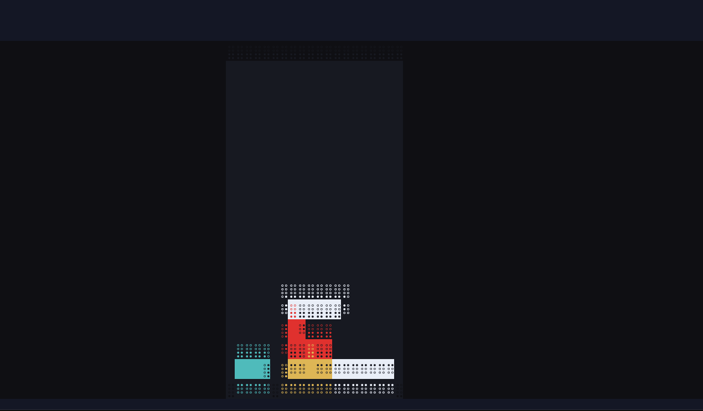

<div align="center">

<h1>摸鱼 Moyu</h1>

<p><strong>Agent 在干活，你在掌机里。任务一结束，一键回到工作。</strong></p>

<p>
  <a href="https://github.com/PrometheusTT/moyu/actions/workflows/ci.yml"></a>
  <a href="https://github.com/PrometheusTT/moyu/releases"></a>
  
  <a href="./LICENSE"></a>
</p>



<p>
  <a href="#快速开始">快速开始</a> ·
  <a href="#它如何工作">工作方式</a> ·
  <a href="#cartridge-游戏生态">Cartridge</a> ·
  <a href="./CONTRIBUTING.md">参与贡献</a> ·
  <a href="./docs/troubleshooting.md">故障排查</a>
</p>

</div>

Moyu 是一个轻量、local-first 的终端游戏宿主。它把 Codex、Claude Code 或其他 coding CLI
放进真实 PTY，平时只在终端右下安全边缘显示一个安静的 `·`。按一次 `Ctrl+]`，即可在不
结束 agent 会话的前提下打开掌机；任务完成后，Moyu 保存游戏、把输入交还 CLI，并用 `•`
提示有未查看事件。

> [!IMPORTANT]
> Moyu 当前处于 `0.x` 阶段。核心终端安全边界有完整自动化测试，但 Cartridge API 在 `1.0`
> 之前仍可能调整。生产工作流中请先运行 `moyu doctor`，并保留常用终端的正常恢复手段。

## 为什么是 Moyu

- **工作优先**：CLI 的输入、输出、信号、退出码和终端状态始终优先于游戏。
- **一键往返**：`Ctrl+]` 进入或离开游戏；不会结束正在运行的 Codex/Claude 会话。
- **两行也能玩**：Codex 中可将 80×8 的微型构图放在输入框正上方两行。
- **多档渲染**：Kitty Graphics、彩色 Braille、半块字符逐级降级。
- **本地优先**：无需账户、daemon 或运行时服务端；存档保存在本机。
- **可扩展**：内置动作、网格和落块三类游戏，也支持本地 JavaScript Cartridge。
- **为终端失败而设计**：resize、备用屏、背压、信号退出和 worker 崩溃都有恢复路径。

```text
┌──────────────────── coding CLI ────────────────────┐
│  agent 正在运行；输入、滚屏与快捷键仍属于 CLI       │
│  ⠈⠙⠦ 火柴快斩 / 贪吃蛇 / 落块（两行微型模式）     │
├──────────────────── Codex 输入框 ──────────────────┤
└────────────────────────────────────────────────────┘
```

## 快速开始

### 环境要求

- Node ≥ 20（Node.js 20 或更高版本）
- macOS、Linux，或 Windows WSL
- 一个交互式终端；普通 UTF-8 + ANSI 终端即可使用字符渲染

### 安装

```sh
npm install --global moyu-game
moyu doctor
```

发布包包含编译后的 `dist/`，安装过程不需要 TypeScript、不执行构建脚本，也不会启动后台
服务。需要验证尚未发布的默认分支时，也可以使用
`npm install --global github:PrometheusTT/moyu`。

升级或卸载：

```sh
npm install --global moyu-game@latest  # 升级到最新稳定版
npm uninstall --global moyu-game       # 卸载
```

### 开始玩

```sh
moyu -- codex          # 包住 Codex
moyu -- claude         # 包住 Claude Code
moyu play              # 独立打开掌机
moyu play snake        # 直接进入指定游戏
moyu games list        # 查看可用 Cartridge
```

第一次建议先运行 `moyu play` 熟悉按键，再包裹正在使用的 coding CLI。

## 操作

外壳默认把输入完整交给 coding CLI，只有明确进入游戏后，游戏键才由 Moyu 接管。

| 按键 | 行为 |
| --- | --- |
| `Ctrl+]` | 进入或离开游戏；SSH 下也可直接透传 |
| `F12` | `Ctrl+]` 的兼容备用键 |
| `Esc` / `q` | 从游戏返回 CLI，不结束 agent 会话 |
| `Tab` | 切换 Cartridge |
| `E` | 在两行微型视图与展开视图之间切换 |
| `?` | 显示或关闭帮助；帮助打开时暂停游戏 |
| `WASD` / 方向键 | 移动；不同 Cartridge 会使用其中一部分 |
| `J` / 空格 | 主动作、攻击、跳跃或直落，取决于当前游戏 |
| `Ctrl+C` / `Ctrl+G` / `Ctrl+Space` | 始终交给 coding CLI，不被 Moyu 占用 |

内置游戏：

- **Stick Slash / 火柴快斩·无尽江湖**：快斩、多足妖物、武侠剑谱；每关出怪 30 秒，此后停止刷怪，必须消灭全部敌人和 Boss 才结算。无关数上限，结算 1.4 秒后自动继续，也可按 J 立即出发。
- **Snake / 贪吃蛇**：方向键或 WASD 转向。
- **Blocks / 落块**：方向键或 WASD 移动，空格直落。

存档默认位于 `~/.moyu/state/`。收起游戏、查看帮助或隐藏画面时模拟会暂停，不会在恢复后
突然追帧。

### 无尽江湖：操作与养成

`A/D` 移动，`J` 快斩，空格跳跃，`U` 冲刺斩，`I` 旋斩；蹲下、移动或空中挥刀有不同变招。
普通击破获得 12 点剑气，储气上限 300；剑招击杀提升阅历，但不为自己补充剑气。
同一组按键根据当前剑气选择档位：起手 / 60气强化；普通分式扣对应档位消耗，保留零头。
达到 100 气则释放奥义——一记统一风格的收招，只扣 100，余量保留；例如 172 气放九剑归一后剩 72 气，再按即出破气式。

| 组合键 | 剑法 | 起手/强化 | 解锁 |
| --- | --- | --- | --- |
| `S` → `U` | 独孤九剑 | 10/60 气 | 初始可用 |
| `S` → `I` | 六脉神剑 | 15/60 气 | 累计 12 击破 |
| `W` → `I` | 太极剑 | 15/60 气 | 累计 36 击破 |
| `S` → `D` → `U` | 天外飞仙 | 30/60 气 | 累计 60 击破 |
| `S` → `A` → `I` | 万剑归宗 | 30/60 气 | 累计 100 击破 |

独孤起手破剑、强化破气，100气施展九剑归一；六脉起手少商剑、强化三脉并发，100气六脉齐发。
太极、飞仙、归宗与两套动漫彩蛋为游戏简式编排，完整招式及门槛见 `?` 剑谱，不声称复刻全部原作招式。
奥义演出约1.2秒，仍可移动、跳跃与闪避；一次只增加一次剑法熟练度，对同一Boss最多造成4次剑招伤害。

三键大招在 650ms 内按顺序输入，方向键也可替代 WASD；现有两键剑招不变。
剑谱另藏两份动漫彩蛋秘卷，按提示探索，第一次成功释放后会显示真名并永久记录熟练度。
战场占右侧约三分之二并随终端加宽；左侧常驻 HUD 只留血量、剑气、当前剑招与战斗警告。
按 `?` 打开暂停帮助查看完整剑谱，`[` / `]` 翻页；战斗中按方括号也会先打开帮助。
Boss 有生命刻度、受击闪白和击退；红色地线提示冲撞/地裂落点，地裂可跳跃或移开躲避。
竹林的螳螂与甲虫、石桥的蟹与鳗、沙漠的蝎、雪山的狼与冰晶、古塔的蝠与石像各有轮廓。

终端组合键可按顺序输入：先按方向，再在约 0.34 秒内按动作键，无需同时按住。
按 `E` 展开战场，按 `?` 查看各招等级、消耗和解锁进度。成功出招积累熟练度，第 6 / 24 / 54 / 96 次使用分别升至二 / 三 / 四 / 五重，多数剑招范围随之扩大。
剑谱、阅历和剑气每 5 秒及收起时自动保存；关卡从最近完成的结算点续跑。旧版存档自动迁移，保留累计击破。
竹海、石桥、山门、大漠、雪岭、古塔循环出现，每三关有蛛王；刷怪压力与同屏数量逐步增加后封顶，同屏最多六只。
Boss 每次登场增加 2 格生命：第 3 / 6 / 9 关分别为 5 / 7 / 9 格，第 33 关达到 25 格上限。
追击速度最多提升 40%，攻击间隔最多缩短 35%，蓄势前摇最低 500ms；第 15 关起地裂增至五处落点。
阶段按剩余生命比例切换，场景循环不会重置成长；伤害仍为每击一格，保留跳跃/走位躲避窗口。

## 它如何工作

Moyu 不模拟 shell。它启动一个真实 PTY，并在终端、宿主与内层 CLI 之间维护清晰的所有权：

1. `bin/moyu` 选择源码或编译入口，并启动独立 supervisor。
2. worker 在接管 raw mode、滚动区或 Kitty 图片前先提交 terminal lease。
3. 内层 CLI 输出经过字节级透传，只重写必须限制在安全区域内的终端坐标。
4. 游戏帧是可丢弃工作；stdout 拥塞时优先暂停游戏并保证 CLI 字节有序。
5. worker 异常退出或被 `SIGKILL` 后，supervisor 使用最后确认的状态恢复终端。

更完整的模块边界、生命周期和测试层级见 [架构说明](./docs/architecture.md)。不可协商的产品
约束记录在 [PRODUCT.md](./PRODUCT.md)。

## 渲染与兼容性

| 档位 | 适用环境 | 特点 |
| --- | --- | --- |
| Kitty Graphics | Kitty、Ghostty、WezTerm 等兼容终端 | 原生 RGB 设备像素、最高画质 |
| 彩色 Braille | 主流 UTF-8/ANSI 终端、SSH、Termius | 每字符 2×4 逻辑像素，通用默认回退 |
| 半块字符 | 字形或协议能力受限的终端 | 每字符 1×2 逻辑像素，最低兼容档 |

Moyu 会主动探测能力。探测明确失败时不会盲发图片协议；在 `tmux`/`screen` 中默认使用字符档。
SSH 将宿主帧率降为 15 fps，本地默认为 30 fps。

调试覆盖：

```sh
MOYU_TIER=graphics moyu -- codex      # 优先尝试图片档，失败时安全回退
MOYU_TIER=braille moyu -- codex       # 强制通用字符档
MOYU_TIER=half moyu -- codex          # 强制最低兼容档
MOYU_CELL=16x34 moyu -- codex         # 手动指定终端格像素
MOYU_THEME=light moyu -- codex        # 原生像素浅色主题
MOYU_REDUCE_MOTION=1 moyu -- codex    # 关闭震屏与闪白
MOYU_OVERLAY=1 moyu -- my-codex       # 为自定义 Codex 启动器启用输入框识别
```

客户端实测状态、性能基线和人工验收步骤见 [终端兼容与视觉 QA](./docs/terminal-qa.md)。

## 可选的任务联动

不安装 hook 也能完整游玩。启用后，任务开始、完成或需要确认时，Moyu 可以保存状态、交还
输入焦点并更新候场标记。

```sh
moyu setup                         # 为检测到的 Codex / Claude Code 安装 hook
moyu install                       # 只预览计划，不写文件
moyu install --write               # 写入，并先备份原配置
moyu install --uninstall --write   # 卸载 Moyu 自己添加的部分
```

Codex 配置位于 `~/.codex/hooks.json`，Claude Code 配置位于 `~/.claude/settings.json`。
安装器会合并而不是覆盖已有配置。hook 只追加时间戳和 `start` / `done` / `notify` 事件，不写入
prompt、命令、输出、错误文本、文件路径或仓库名。

Codex 首次加载新 hook 时会显示 `Hooks need review`；需要选择 `Trust all and continue` 才会生效。

## Cartridge 游戏生态

本地 Cartridge 是一个包含 `moyu.game.json` 和 ESM 入口的目录：

```sh
moyu games add ./my-game          # 预览权限警告
moyu games add ./my-game --yes    # 明确信任后安装
moyu games remove my-game --yes
```

> [!WARNING]
> Cartridge 是受信任的本地 JavaScript 代码，不是沙箱。它拥有与 Moyu 进程相同的文件和网络
> 权限。只安装你阅读过或信任来源的 Cartridge。

API v1 的 manifest、生命周期、画布接口、像素渲染和最小示例见
[Cartridge 开发指南](./docs/cartridge-api.md)。

## 诊断与恢复

```sh
moyu doctor             # Node、PTY、hook 与事件文件状态
moyu doctor --caps      # 显示 graphics / braille / half 选择结果
moyu doctor --gfx       # 绕开探测，直接验证 Kitty 图片链路
moyu doctor --visual    # 交互式原生像素动作对比
moyu doctor --reset     # 无条件恢复常见终端模式并删除 Moyu 图片
```

遇到花屏、乱码、图片不显示、hook 不触发或 PTY 模块加载失败时，请查看
[故障排查指南](./docs/troubleshooting.md)。提交终端兼容问题前，建议附上 `moyu doctor --caps`
输出，并移除用户名、主机名、IP 和本地路径。

## 开发

开发源码需要 Node.js 22.6 或更高版本；发布后的 `dist/` 仍支持 Node.js 20。

```sh
git clone https://github.com/PrometheusTT/moyu.git
cd moyu
npm ci
npm run check       # 类型检查 + 完整测试套件
npm run compile     # 更新必须随仓库提交的 dist/
npm run smoke       # source/dist PTY 启动检查
npm pack --dry-run
```

贡献前请阅读 [CONTRIBUTING.md](./CONTRIBUTING.md)。项目使用 MIT License，并要求所有社区互动
遵守 [行为准则](./CODE_OF_CONDUCT.md)。安全问题请不要公开提交，参见
[SECURITY.md](./SECURITY.md)。

## 项目状态与路线

已经完成：

- 真实 PTY 外壳、终端 supervisor 与崩溃恢复
- 三档渲染、原生 Kitty 像素路径和确定性视觉/性能基线
- 三个内置 Cartridge 与本地 Cartridge API v1
- Codex / Claude Code 可选任务事件联动

仍在探索：

- 更多终端图片协议（例如 Sixel、iTerm2 inline images）
- 更广泛的真实终端、SSH 和 WSL 人工兼容矩阵
- Cartridge API 稳定化、示例模板与社区分发方式

版本变化记录见 [CHANGELOG.md](./CHANGELOG.md)。功能建议请使用
[Feature request](https://github.com/PrometheusTT/moyu/issues/new?template=feature_request.yml)。

## License

[MIT](./LICENSE) © 2026 Moyu contributors.
