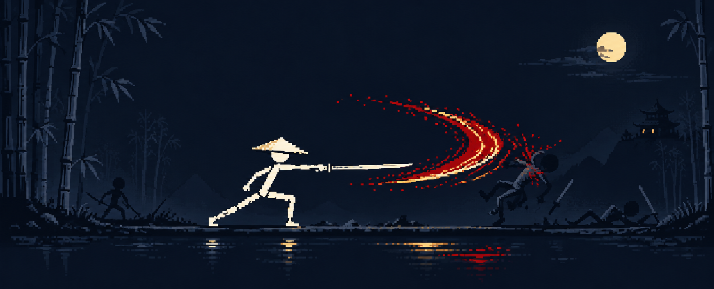
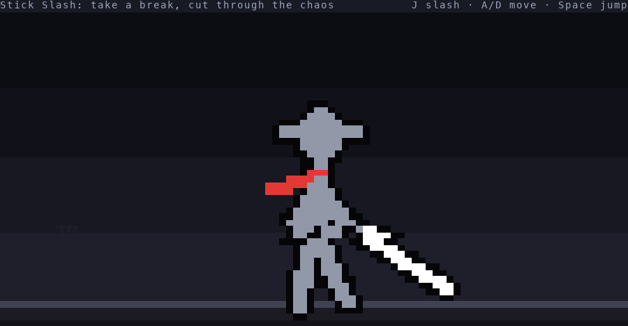

# Moyu · Stick Slash

A stick-figure action game inside your terminal. Play on its own or wrap Codex, Claude Code, or another coding CLI. While you work, Moyu occupies one quiet row. Press `Ctrl+]` to play and press it again to return; progress is saved automatically.



[简体中文](./README.zh-CN.md) · [Quick start](#quick-start) · [See it in action](#see-it-in-action) · [Controls](#controls) · [Troubleshooting](./docs/troubleshooting.en.md)

## Quick start

Requires **Node >= 20** and an interactive terminal. macOS, Linux, and native Windows 10/11 are supported.

On macOS or Linux with Node installed:

```sh
npm install --global moyu-game@0.2.0
moyu demo
```

`moyu demo` opens the game full-screen so you can try it without installing Codex or Claude Code. Press `q` to leave. To keep your coding session open with a quiet one-row game beside it, run `moyu -- codex` or `moyu -- claude`; press `Ctrl+]` to enter or leave the game. Your game progress is saved automatically.

If your Mac does not have Node, use the [macOS installer](./install/macos.sh). Windows does **not** require WSL. Run this in PowerShell:

```powershell
$file = Join-Path $env:TEMP 'moyu-native-install.ps1'
Invoke-WebRequest https://raw.githubusercontent.com/PrometheusTT/moyu/main/install/windows-native.ps1 -OutFile $file
powershell -NoProfile -ExecutionPolicy Bypass -File $file
```

The installer sets up Node and WezTerm if needed. Open a new WezTerm PowerShell tab, then run `moyu demo`. If you already have a coding CLI installed, you can wrap it instead:

```sh
moyu -- codex
moyu -- claude
```

On Windows, install the native Windows version of the CLI you want to wrap. For the latest development commit instead of the npm release, install `https://codeload.github.com/PrometheusTT/moyu/tar.gz/refs/heads/main` with `npm install --global`.

## See it in action



The clip above is a real play session in the text fallback tier, recorded without a coding CLI. High-resolution terminals can render finer graphics; `moyu doctor --caps` shows which tier your terminal selects.

- **Actual play:** run `moyu demo` after installation. This uses your terminal's available graphics tier and starts at normal progression.
- **Sword-art showcase:** from a source checkout, run `npm run showcase:en` for a 26-second sequence of all seven arts. It starts with unlocked moves and full qi for recording, so it is a staged showcase rather than a normal run. See the [recording guide](./docs/showcase.md).
- **Beside an agent:** run `moyu -- codex` or `moyu -- claude`, then press `Ctrl+]` while the agent is working. Press it again to return to the same coding session.

Moyu needs Node 20+ and an interactive terminal. Graphics quality depends on your terminal; use `moyu doctor --caps` to see the selected tier. [Open a terminal report](https://github.com/PrometheusTT/moyu/issues/new) if the game does not render correctly, including your OS, terminal, and `doctor --caps` output.

## Controls

When Moyu wraps a coding CLI, keys belong to that CLI until you enter the game.

| Key | Action |
| --- | --- |
| `Ctrl+]` | Enter or leave the game; `F12` is an alternative |
| `Esc` / `q` | Return to the CLI without ending its session |
| `E` | Expand or collapse the battlefield |
| `?` | Pause and view the sword-art guide and unlock progress; `[` / `]` changes pages |
| `A` / `D` | Move left / right |
| `J` | Quick slash; movement, crouching, and jumping change the strike |
| Space / `K` | Jump |
| `U` / `I` | Dash slash / spin slash |
| `S` → `K` | Iron Guard: break control and defend in place; you cannot move or attack, but still take damage |

Enter combinations in order; do not hold their keys together. `Ctrl+C`, `Ctrl+G`, and `Ctrl+Space` remain available to the coding CLI.

## Play and progression

Enemies spawn for about 30 seconds per stage. Defeat every remaining enemy and boss to finish the stage. A boss appears every three stages; mantis, scarab, crystal, and spider bosses rotate in. Early bosses have simpler moves, while later ones add combos, knockback, and brief control effects. Red ground marks and blue ice fields warn you to dodge.

Hits build qi for sword arts. Defeats build insight, which unlocks arts and permanently improves your maximum health and some cooldowns. Using an art raises its mastery and reach. Sword arts, insight, qi, and stage checkpoints save automatically.

## Sword arts

Press each key in sequence. The unlock number is **insight**, not the number of times you cast the art. The qi column is the base cost for its first tier.

| Keys | Art | Unlock insight | Base qi |
| --- | --- | ---: | ---: |
| `S` → `U` | Dugu Nine Swords (独孤九剑) | Starting art | 10 |
| `S` → `I` | Six Meridian Divine Sword (六脉神剑) | 12 | 15 |
| `W` → `I` | Taiji Sword (太极剑) | 36 | 15 |
| `W` → `D` → `J` | Getsuga Tenshō (月牙天冲), secret art | 48 | 20 |
| `S` → `D` → `U` | Heavenly Flying Fairy (天外飞仙) | 60 | 20 |
| `W` → `A` → `J` | Sun Breathing (日之呼吸), secret art | 80 | 20 |
| `S` → `A` → `I` | Myriad Swords Return to the Source (万剑归宗) | 100 | 20 |

Qi below 60 uses the first set of forms; 60–99 uses the second; 100 or more uses the third. Later tiers cost 3 or 6 extra qi. Forms rotate within each tier, and the last form in the highest tier has a finishing move. Press `?` in-game for individual forms and your progress. `S` → `K` is a separate defensive move: Iron Guard initially lasts 0.8 seconds with a 6-second cooldown. It clears control and prevents knockback or stagger during the guard, but it is not invulnerability.

“Myriad Swords Return to the Source” is this project's English rendering, not a verified official translation.

To record every art without manual inputs, run `npm run showcase:en` or `npm run showcase:zh` from a source checkout. See the [recording guide](./docs/showcase.md).

## Terminals and graphics

Moyu probes your terminal and chooses Kitty Graphics, color Braille, or half-block text. These terminals are currently known to support high-resolution play:

| Terminal | Platform |
| --- | --- |
| Kitty | macOS / Linux |
| Ghostty | macOS / Linux |
| WezTerm | macOS / Linux / Windows |
| iTerm2 | macOS |

Run `moyu doctor --caps` to see your actual graphics tier or `moyu doctor --gfx` to check image output. Other terminal reports are welcome through [Issues](https://github.com/PrometheusTT/moyu/issues); see the [terminal QA guide](./docs/terminal-qa.md) for what to include.

## Task integration

Task integration is optional. When enabled, Moyu saves the game and updates its status when an agent task starts, finishes, or needs confirmation:

```sh
moyu setup                       # Install detected Codex / Claude Code hooks
moyu install                     # Preview configuration changes
moyu install --write             # Apply changes and back up the original file
moyu install --uninstall --write # Remove Moyu hooks
```

Codex uses `~/.codex/hooks.json`; Claude Code uses `~/.claude/settings.json`. The installer merges existing settings. Hooks record only events and timestamps, never prompts, output, or error text. If Codex shows `Hooks need review`, choose `Trust all and continue` to enable the new hooks.

## Update

To update the npm release, run `npm install --global moyu-game@latest` (`npm.cmd` in Windows PowerShell). Saves are kept. If you installed directly from GitHub and want the latest `main` commit even when its package version is unchanged, remove and reinstall that source. On macOS / Linux:

```sh
npm uninstall --global moyu-game
npm install --global 'https://codeload.github.com/PrometheusTT/moyu/tar.gz/refs/heads/main'
```

Windows PowerShell:

```powershell
npm.cmd uninstall --global moyu-game
npm.cmd install --global "https://codeload.github.com/PrometheusTT/moyu/tar.gz/refs/heads/main"
```

Restart Moyu after updating; running processes do not reload automatically.

## Language

Moyu's built-in games and CLI messages (including `doctor` and `install`) follow the system locale: Chinese for Chinese locales, English otherwise. Override it for one run with `moyu --lang en play stick-slash` or `moyu --lang zh -- codex`; `MOYU_LANG=en` and `MOYU_LANG=zh` also work. Put Moyu's `--lang` before `--` when wrapping a CLI; arguments after `--` belong to that CLI. Third-party Cartridges provide their own text.

## Create with us

Bug reports, terminal testing, translations, enemies, and sword arts are welcome. Search [Issues](https://github.com/PrometheusTT/moyu/issues) first, then open an Issue or Pull Request; small fixes can go straight to a PR. You can also build a local game with the [Cartridge quickstart](./docs/cartridge-quickstart.en.md). See the [contribution guide](./CONTRIBUTING.en.md) for the full workflow.

Source development requires Node.js 22.6 or later:

```sh
git clone https://github.com/PrometheusTT/moyu.git
cd moyu
npm ci
npm run check
npm run compile
```

Commit the generated `dist/` alongside source changes.

## Uninstall

If you enabled task integration, run `moyu install --uninstall --write` first, then `npm uninstall --global moyu-game` (`npm.cmd` on Windows). Saves and local Cartridges remain in `~/.moyu`; delete that directory manually only if you no longer want them. Node and WezTerm are separate applications and remain installed.

If the terminal state looks wrong after a crash, run `moyu doctor --reset`. More help is in [Troubleshooting](./docs/troubleshooting.en.md). This project uses the [MIT License](./LICENSE); report security issues through the [security policy](./SECURITY.md).
